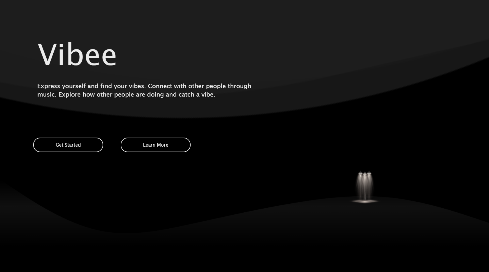
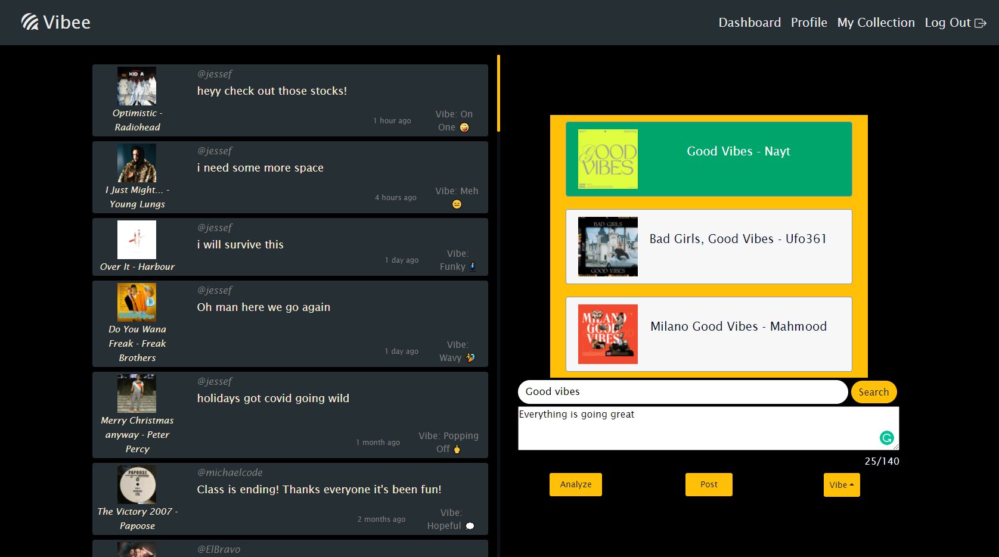
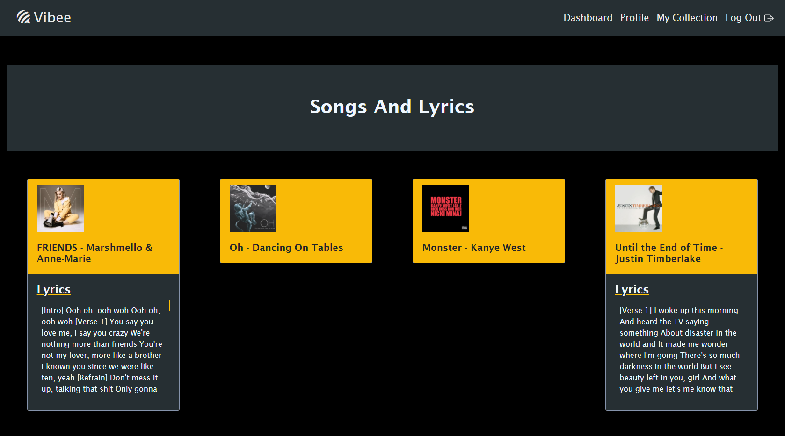

<body style="background-color: rgb(35,35,35); font-family: Times New Roman; font-size: 16px;>

<div style="color: yellow;">

# Find-Your_Vibe

</div>

<div style="text-align: left;">

  

</div>

## Table Of Contents

1. [Description](#Description)
1. [User-Story](#User-Story)
1. [User-Demo](#User-Demo)
1. [Installation&Usage](#Installation&Usage)
1. [License](#License)
1. [Questions](#Questions)

## Description

In this application, the user can write a blurb in which they can analyze their text to find song lyrics based off what they typed in the blurb. The system will check the post for nouns and make a query to send a api call to Genius Lyrics to return the song name, artist, and lyrics for the chosen song.

## User-Story

```
 AS A USER, 
 I want to be able to write how I feel and select a song that matches what I am feeling.
```

## User-Demo

From the home screen, users can use the Get Started Button to sign-up/log in or the Learn More button to learn more about Vibee.<br><br>

<br><br>
On the Dashboard, users can analyze write a post and use the analyze button or search bar to choose a song to match your feelings on the song.<br><br>

<br><br>
Songs and posts are saved onto each user's individual profiles and "Collection" tabs to be viewed again later. <br><br>



## Installation&Usage

Must download and install [Node](https://nodejs.org/en/download/)

Developers may install dependencies within the package.json file with the following command in your terminal:

```
npm install
```
This command will automatically navigate into the client folder and install all additional dependencies.
<br>


Some of the packages used include:

- [axios](https://www.npmjs.com/package/axios)
- [react](https://www.npmjs.com/package/react) 
- [react-dom](https://www.npmjs.com/package/react-dom) 
- [bootstrap](https://www.npmjs.com/package/bootstrap) 
- [react-router-dom](https://www.npmjs.com/package/react-router-dom) 
- [react-scripts](https://www.npmjs.com/package/react-scripts) 
- [web-vitals](https://www.npmjs.com/package/web-vitals) 
- [genius-lyrics](https://www.npmjs.com/package/genius-lyrics)
- [firebase](https://www.npmjs.com/package/firebase)
- [socket.io](https://www.npmjs.com/package/socket.io)

## License

[MIT](https://choosealicense.com/licenses/mit/) Copyright (c) 2020 Jesse Frausto

Permission is hereby granted, free of charge, to any person obtaining a copy
of this software and associated documentation files (the "Software"), to deal
in the Software without restriction, including without limitation the rights
to use, copy, modify, merge, publish, distribute, sublicense, and/or sell
copies of the Software, and to permit persons to whom the Software is
furnished to do so, subject to the following conditions:

The above copyright notice and this permission notice shall be included in all
copies or substantial portions of the Software.

THE SOFTWARE IS PROVIDED "AS IS", WITHOUT WARRANTY OF ANY KIND, EXPRESS OR
IMPLIED, INCLUDING BUT NOT LIMITED TO THE WARRANTIES OF MERCHANTABILITY,
FITNESS FOR A PARTICULAR PURPOSE AND NONINFRINGEMENT. IN NO EVENT SHALL THE
AUTHORS OR COPYRIGHT HOLDERS BE LIABLE FOR ANY CLAIM, DAMAGES OR OTHER
LIABILITY, WHETHER IN AN ACTION OF CONTRACT, TORT OR OTHERWISE, ARISING FROM,
OUT OF OR IN CONNECTION WITH THE SOFTWARE OR THE USE OR OTHER DEALINGS IN THE
SOFTWARE.

## Contact-Info

_<strong style="font-size: 22px;">Jesse Frausto</strong>_

<strong style="color: palegoldenrod;">GitHub:</strong> https://github.com/jfrausto

<strong style="color: palegoldenrod;">Email:</strong> fraustojesse24@gmail.com

_<strong style="font-size: 22px;">Michael Moreno</strong>_

<strong style="color: palegoldenrod;">GitHub:</strong> https://github.com/mgmoreno22

<strong style="color: palegoldenrod;">Email:</strong> michaelmoreno751@gmail.com

_<strong style="font-size: 22px;">Jose Ulices Perez Jr.</strong>_

<strong style="color: palegoldenrod;">GitHub:</strong> https://github.com/JOCECODE

<strong style="color: palegoldenrod;">Email:</strong> jocecode27@gmail.com

Feel free to email the team with any questions with the application or troubleshooting. Provide your name and or contact info and we will get back to you ASAP.

</body>
